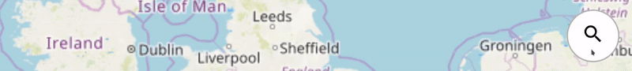

# Leaflet.AnimatedSearchbox

  

A simple Leaflet plugin that provides a collapsible search box.



## Usage

Include the `Google Icons` stylesheet and the `Leaflet.AnimatedSearchBox.css` file in the head section of your document:

```html
<link href="https://fonts.googleapis.com/icon?family=Material+Icons" rel="stylesheet">
<link href="src/AnimatedSearchBox.css" rel="stylesheet">
```

Include the `Leaflet.AnimatedSearchBox.js` file in your document:

```html
<script src="src/AnimatedSearchBox.css"></script>
```

Create a new `L.Control.Searchbox` and add it to the map:

```javascript
var searchbox = L.control.searchbox({
    position: 'topright',
    expand: 'left'
}).addTo(map);
```

### [Examples](https://luka1199.github.io/Leaflet.AnimatedSearchbox/examples/)

- [Basic Example](https://luka1199.github.io/Leaflet.AnimatedSearchbox/examples/example1.html)
- [Fuse.js Example](https://luka1199.github.io/Leaflet.AnimatedSearchbox/examples/example_fuse.html)

### Options

- `position`: Sets the position of the searchbox (Default: `'topright'`).  
- `expand`: Sets the direction in which the search box expands. (Default: `'left'`).  
- `collapsed`: Sets the initial state of the searchbox (Default: `false`).  
- `id`: Sets the id of the container of the searchbox.  
- `class`: Adds custom classes to the container of the searchbox.  
- `width`: Sets the width of the input field of the searchbox. (Example: `'450px'`)

### Methods

```javascript
// Expand the searchbox
searchbox.show()

// Collapse the searchbox
searchbox.hide()

// Toogle the searchbox
searchbox.toggle()

// Returns true if searchbox is collapsed
searchbox.isCollapsed()

// Returns current value of the text field of the searchbox
searchbox.getValue()

// Sets the value of the text field of the search box
searchbox.setValue(value)

// Clears the text field of the search box
searchbox.clear()

// Adds a listener function (handler) to a particular DOM event (event) 
// of the input field of the searchbox
searchbox.onInput(event, handler);

// Removes a previously added listener function (handler) of a particular DOM event (event)
// from the input field of the searchbox
searchbox.offInput(event, handler);

// Adds a listener function (handler) to a particular DOM event (event) 
// of the button of the searchbox
searchbox.onButton(event, handler);

// Removes a previously added listener function (handler) of a particular DOM event (event)
// from the button of the searchbox
searchbox.offButton(event, handler);

```

### Requirements

- [Google Icons](https://google.github.io/material-design-icons/)

## Planned features

- A drop-down list to easily implement autocomplete
- Support for npm etc.
